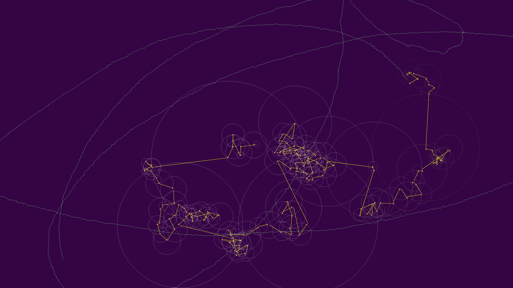
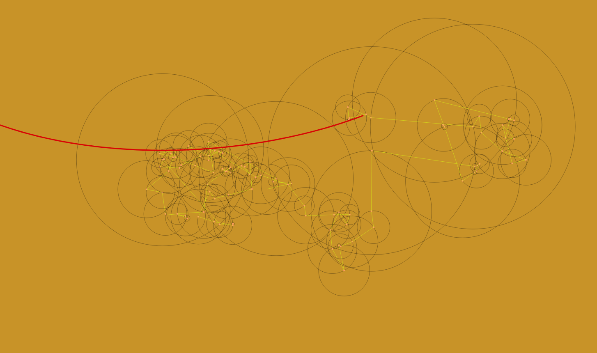
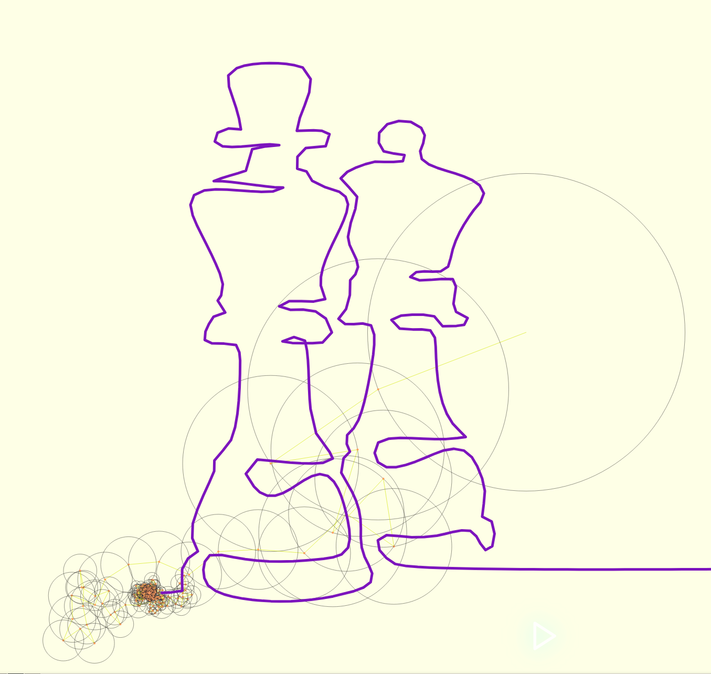

# Visualization of fourier transformations

www.hennegit.github.io

The fourier transform sandbox you didn't know you need. Change colors, spinning speed and radius and create stunning 
animations. You can select pre-designed pictures to be drawn by the fourier step function, draw your own or upload path 
to be drawn. 

Select colors, strokes and rng settings for randomized spinning circles: 

Explore preset paths or create your own: 

